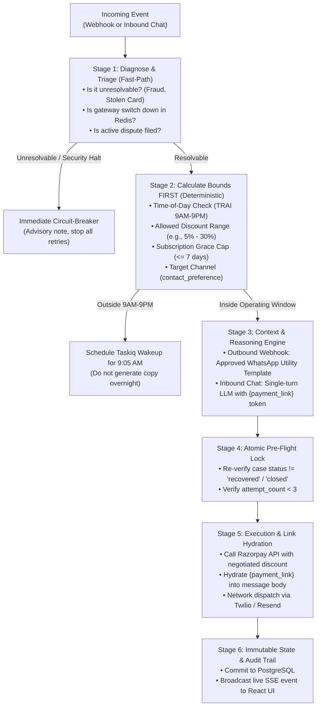

# 📋 Renvue: Identified Issues, Bugs & Technical Debt Tracking

This document consolidates all critical bugs, business logic gaps, architectural inefficiencies, and compliance blind spots identified during the critical review of the **Renvue** Revenue Recovery Agent.

---

## 🔴 Priority 1: Critical Code Bugs & Runtime Defects

### 1. [DONE] ✅ Fragile Date Parsing & Silent Bypass of `sanity_date`
* **File:** [`backend/src/agent/tools.py`](file:///home/dinesh/Desktop/projects/renvue/backend/src/agent/tools.py#L403-L446)
* **Status:** `RESOLVED` (Fixed in `tools.py`)
* **The Bug:**
  1. In `log_promise_to_pay`, date parsing uses `datetime.fromisoformat(date_str)`.
  2. If the user replies with natural language dates (e.g., `"15th"`, `"next Friday"`, `"tomorrow"`) or non-ISO formats, `fromisoformat()` raises a `ValueError`.
  3. The `except Exception:` block catches it and **silently overrides the date to `now + timedelta(days=3)`**.
  4. Because `now + 3 days` is always in the future, `sanity_date()` returns `True`, completely bypassing the sanity check and scheduling an unintended follow-up without validation.
* **Resolution:**
  - Implemented safe multi-format date parsing (`YYYY-MM-DD`, `DD/MM/YYYY`, `DD-MM-YYYY`, `YYYY-MM-THH:MM:SS`, and ISO).
  - If date is invalid or unparseable, `target_date` is `None` which safely fails `sanity_date(None) -> False`, triggering clean human escalation without runtime crashes.

---

### 2. [DONE] ✅ Sub-Tool Invocation Anti-Pattern in `escalate_to_human`
* **Files:** [`backend/src/agent/tools.py:530-545`](file:///home/dinesh/Desktop/projects/renvue/backend/src/agent/tools.py#L530-L545), [`backend/src/agent/nodes.py:330-335, 450-455, 500-510`](file:///home/dinesh/Desktop/projects/renvue/backend/src/agent/nodes.py#L330-L335)
* **Status:** `RESOLVED` (Fixed in `tools.py` and `nodes.py`)
* **The Bug:**
  1. When `log_promise_to_pay` detected a past date, out-of-bounds grace period, or hostile sentiment, it called `return await escalate_to_human.ainvoke(...)` from *inside* the tool function.
  2. In LangGraph, the AI message was generated with a tool call to `log_promise_to_pay`. Calling another tool function internally did not update LangGraph's message history or trigger conditional edges (like `escalate_gate`).
  3. In `nodes.py:audit()`, the graph inspected `last_ai_msg.tool_calls` for `escalate_to_human`. Because it only found `log_promise_to_pay`, the audit handler failed to register the escalation, resulting in inconsistent state between DB and agent memory.
* **Resolution:**
  - Removed `escalate_to_human.ainvoke()` from inside `log_promise_to_pay`. The tool now returns structured `PROMISE_REJECTED: ...` explaining why the promise was declined.
  - Updated `after_execute()` in `nodes.py` to recognize `PROMISE_REJECTED` and route control back to `decide_reply` rather than prematurely terminating to audit.
  - Updated the LLM prompt instructions in `nodes.py` to mandate calling `escalate_to_human` upon receiving `PROMISE_REJECTED`.
  - Hardened `audit()` in `nodes.py` to preserve and record `rs.recovery_status == "escalated"` consistently across both DB state and LangGraph memory.

---

### 3. [DONE] ✅ Immediate 1-Minute Runaway Retry on Past/Today Timestamps
* **File:** [`backend/src/agent/tools.py`](file:///home/dinesh/Desktop/projects/renvue/backend/src/agent/tools.py#L48-L51)
* **Status:** `RESOLVED` (Fixed in `tools.py`)
* **The Bug:**
  ```python
  now = datetime.now()
  if target_date <= now:
      target_date = now + timedelta(minutes=1)
  ```
  If a customer says *"I will pay today"* and the parsed date evaluates to midnight (`00:00:00`), `target_date <= now` evaluates to `True`. The system immediately schedules a task for **1 minute from now**, bombarding the customer with an unintended immediate follow-up.
* **Resolution:**
  - In `log_promise_to_pay`, if a customer commits to paying today, the scheduled retry snaps to 6:00 PM (end-of-business) or `now + 2 hours`, preventing the 1-minute runaway loop.

---

### 4. [DONE] ✅ "Ghost Link" Defect: Payment Link Missing from Outbound WhatsApp Messages
* **Files:** [`backend/src/agent/nodes.py:280-285`](file:///home/dinesh/Desktop/projects/renvue/backend/src/agent/nodes.py#L280-L285), [`backend/src/agent/tools.py:120-140, 350-410`](file:///home/dinesh/Desktop/projects/renvue/backend/src/agent/tools.py#L350-L410)
* **Status:** `RESOLVED` (Fixed in `tools.py` and `nodes.py`)
* **The Flaw:**
  - In `decide_event`, the agent queued `create_payment_link` and `send_whatsapp_msg` as independent tool calls.
  - The text passed to `send_whatsapp_msg` said: *"Please click the link to authorize"* or *"Click the payment link to complete your order"*, but **the generated short URL was never injected into the message body**.
  - Customers received instructions to click a link that did not exist in the text.
* **Resolution:**
  - Updated `send_whatsapp_msg` in `tools.py` to automatically hydrate outgoing messages:
    1. Checks if `state.error_details["payment_link"]` exists, or awaits concurrent `create_payment_link` execution.
    2. If missing and message requires a link, generates a Razorpay payment link on-the-fly.
    3. Replaces explicit `{payment_link}` placeholder tokens, or cleanly appends `\n\n🔗 Pay securely: {payment_link}` right before the `(Ref: #RNV-...)` footnote.
    4. Guards against non-recovery / downtime / unresolvable messages so links are only attached when appropriate.
  - Also updated `send_email_reminder` in `tools.py` to use the real generated Razorpay link from `state.error_details["payment_link"]`.
  - Updated `decide_reply` system prompt in `nodes.py` to guide LLM that outbound messages are automatically hydrated with payment links or can use `{payment_link}` tokens.

---

### 5. [DONE] ✅ Config Alias Mismatch Causing 0% to 0% Discount Bug & Non-Discountable Links
* **Files:** [`backend/src/config/config.py:21-22`](file:///home/dinesh/Desktop/projects/renvue/backend/src/config/config.py#L21-L22), [`backend/src/models/schema.py:191-195`](file:///home/dinesh/Desktop/projects/renvue/backend/src/models/schema.py#L191-L195), [`backend/src/agent/tools.py:152-195`](file:///home/dinesh/Desktop/projects/renvue/backend/src/agent/tools.py#L152-L195), [`backend/src/agent/nodes.py:221,282`](file:///home/dinesh/Desktop/projects/renvue/backend/src/agent/nodes.py#L221)
* **Status:** `RESOLVED` (Fixed in `config.py`, `schema.py`, `tools.py`, `nodes.py`)
* **The Flaw:**
  - `.env` specifies `MIN_DISCOUNT_ALLOWED=5` and `MAX_DISCOUNT_ALLOWED=30`.
  - In `config.py`, missing aliases caused values to default to `0`, instructing Mistral to *"negotiate between 0% and 0% discount"*.
  - Furthermore, `create_payment_link` took 0 arguments and always used full `state.amount_inr`—making it impossible for negotiated concessions to actually be applied to the generated payment link.
* **Resolution:**
  - In `config.py`: Explicitly mapped `alias="MIN_DISCOUNT_ALLOWED"` and `alias="MAX_DISCOUNT_ALLOWED"` with safe defaults (5% and 30%).
  - In `schema.py`: Added `discount_pct: float = 0.0` to `PaymentLinkArgs`.
  - In `tools.py`: `create_payment_link` now accepts `discount_pct`, clamps it between `min_discount` and `max_discount`, computes `effective_amount_inr`, passes it to Razorpay, and records the discount metadata in the audit trail.
  - In `nodes.py`: `abandoned_checkout` now passes `{"discount_pct": 10.0}` to generate the discounted payment link, and the negotiation prompt explicitly guides the LLM to call `create_payment_link` with `discount_pct`.

---

### 6. [DONE] ✅ Customer `contact_preference` Completely Ignored in Routing
* **Files:** [`backend/src/agent/nodes.py:146-240`](file:///home/dinesh/Desktop/projects/renvue/backend/src/agent/nodes.py#L146-L240), [`backend/src/models/models.py:21, 48`](file:///home/dinesh/Desktop/projects/renvue/backend/src/models/models.py#L21)
* **Status:** `RESOLVED` (Fixed in `nodes.py`)
* **The Flaw:**
  - `RecoveryState.contact_preference` was stored in the database, but was never checked in `decide_event()`.
  - The system blasted both Email and WhatsApp regardless of customer preference, and triggered unsolicited AI voice calls for all transactions $> ₹5,000$ without verifying TRAI DND status or user consent.
* **Resolution:**
  - Added `should_send_channel(rs, channel)` helper in `nodes.py`:
    1. **Primary Preference Honoring:** If customer prefers `email`, early attempts only dispatch email (WhatsApp and voice calls are suppressed). If customer prefers `whatsapp`, WhatsApp is prioritized.
    2. **Abandoned Checkout & Subscriptions:** Checks preference before dispatching to prevent duplicate or unwanted channel outreach.
    3. **TRAI DND Compliance for Voice Calls:** AI voice calls are strictly blocked if customer requested text channels (`email` or `whatsapp`), and only permitted if the customer explicitly opted in to calls (`pref == "call"`) or during severe high-debt multi-channel escalation (attempt $\ge 2$, amount $> ₹5,000$).
    4. **Graceful Fallback:** If customer lacks phone contact, gracefully falls back to email; if lacking email, gracefully falls back to WhatsApp.

## 🟠 Priority 2: Business Logic & Subscription Mechanics Gaps

### 7. [DONE] ✅ The 30-Day Subscription Grace Period Exploit ("Free Service Loophole")
* **File:** [`backend/src/agent/tools.py`](file:///home/dinesh/Desktop/projects/renvue/backend/src/agent/tools.py#L408-L465)
* **Status:** `RESOLVED` (Fixed in `tools.py`)
* **The Flaw:**
  - `log_promise_to_pay` accepts any future date without checking against the billing cycle duration.
  - If a monthly SaaS or subscription tier (30 days) fails on Day 1, and the customer tells WhatsApp *"I will pay next month on the 1st"*, the agent pauses reminders for 30 days.
  - If the subscription entitlement is not throttled, the customer receives an entire month of service completely free.
* **Resolution:**
  - Integrated `settings.max_grace_period` (default 7 days) into `sanity_date()`.
  - Any commitment date exceeding `today + settings.max_grace_period` is automatically rejected by `sanity_date()`, triggering human escalation instead of leaving the service active unpaid.

---

### 8. [DONE] ✅ Mandate Re-Authorization vs. One-Time Payment Links
* **Files:** [`backend/src/agent/tools.py`](file:///home/dinesh/Desktop/projects/renvue/backend/src/agent/tools.py), [`backend/src/config/clients.py`](file:///home/dinesh/Desktop/projects/renvue/backend/src/config/clients.py)
* **Status:** `RESOLVED` (Fixed in `clients.py` and `tools.py`)
* **The Flaw:**
  - For recurring subscriptions (`subscription.halted`), the agent previously issued a standard one-time payment link (`create_payment_link`).
  - While this settled the current month's invoice, the underlying card/UPI AutoPay mandate remained expired or broken. Next month, the payment would fail again, destroying customer Lifetime Value (LTV).
* **Resolution:**
  - Added `create_rzp_mandate_update_link` in `clients.py` implementing Razorpay's mandate re-authorization and token migration flow with penny-drop auth (`sub_card_change`).
  - Implemented `_generate_link_for_state` in `tools.py`: dynamically inspects case type and source ID to differentiate between one-time cart/checkout recovery and recurring subscription recovery.
  - Subscriptions automatically receive a Mandate Re-Authorization Link (`mandate_reauthorization` link type with `sub_card_change=True` and `mandate_update=True` stored in case state and audit logs), protecting recurring revenue streams.

---

## 🟡 Priority 3: Architecture, Code Quality & Tech Debt

### 9. Overcomplicated LangGraph Architecture for Deterministic Logic
* **File:** [`backend/src/agent/graph.py`](file:///home/dinesh/Desktop/projects/renvue/backend/src/agent/graph.py) & [`backend/src/agent/nodes.py`](file:///home/dinesh/Desktop/projects/renvue/backend/src/agent/nodes.py)
* **The Flaw:**
  - `decide_event` contains 100% deterministic Python `if/elif/else` statements (checking decline codes, downtime, amounts).
  - Yet it artificially mocks an `AIMessage` with manual tool call dictionaries just to feed LangGraph’s prebuilt `ToolNode`.
  - Tools write directly to PostgreSQL, forcing `audit()` to re-query the database to avoid overwriting state.
  - This introduces unnecessary latency, graph overhead, and state-desync risks across DB, Redis, and memory.
* **Fix:**
  - Decouple:
    1. **Deterministic Rule Engine (Python):** Fast ($<10\text{ms}$), runs webhooks, downtime checks, and salary math directly.
    2. **Conversational Agent (Mistral LLM):** Invoked *only* for inbound human chat replies with 3 bounded tools (`propose_discount`, `record_promise_to_pay`, `escalate_to_human`).

---

### 10. [DONE] ✅ Missing Native LangGraph `interrupt_before` for Human-in-the-Loop
* **Files:** [`backend/src/agent/graph.py:65-75`](file:///home/dinesh/Desktop/projects/renvue/backend/src/agent/graph.py#L65-L75), [`backend/src/agent/nodes.py:185-235, 345-360`](file:///home/dinesh/Desktop/projects/renvue/backend/src/agent/nodes.py#L185-L235)
* **Status:** `RESOLVED` (Fixed in `graph.py` and `nodes.py`)
* **The Flaw:**
  - `escalate_gate` was defined as a pass-through dummy node, but `interrupt_before=["escalate_gate"]` was missing from `workflow.compile()`.
  - Because of this, the graph never paused at the engine level when an escalation occurred; instead it executed to `END`.
  - Furthermore, if an admin clicked "Approve Escalation" on a case with attempt count $\ge 3$, the agent in `decide_reply` immediately triggered another deterministic stop and re-escalated without taking action.
* **Resolution:**
  - Passed `interrupt_before=["escalate_gate"]` to `workflow.compile()` in `graph.py`, natively suspending the LangGraph thread at the checkpointer level.
  - Implemented `mark_case_escalated()` in `nodes.py` to persist `recovery_status = "escalated"`, clear pending background timers, write audit entries, and broadcast the live SSE event to the dashboard.
  - Updated `decide_reply` so that `event_source == "inbound.human_approval"` bypasses the attempt $\ge 3$ stop rule, allowing the agent to proceed with the manager-approved recovery action.

---

### 11. [DONE] ✅ Manual SQLModel-to-Dict Mapping Boilerplate (Violating DRY)
* **Files:**
  - [`backend/src/service/broadcast.py:48-60`](file:///home/dinesh/Desktop/projects/renvue/backend/src/service/broadcast.py#L48-L60) (`broadcast_case_update`)
  - [`backend/src/router/apis.py:38-52`](file:///home/dinesh/Desktop/projects/renvue/backend/src/router/apis.py#L38-L52) (`list_cases`, `get_case`)
  - [`backend/src/models/models.py:58-62`](file:///home/dinesh/Desktop/projects/renvue/backend/src/models/models.py#L58-L62) (`RecoveryState`)
* **Status:** `RESOLVED` (Fixed in `models.py`, `apis.py`, `broadcast.py`)
* **The Flaw:**
  - `SQLModel` inherits directly from Pydantic `BaseModel`.
  - The codebase manually constructed identical 15-line dictionaries across multiple files to avoid `datetime` serialization errors with standard `json.dumps()`.
  - This broke DRY, created maintenance risk when schema columns changed, and risked unhandled serialization errors.
* **Resolution:**
  - Replaced manual dictionary constructions with `state.model_dump(mode="json")` in `broadcast.py` and `apis.py`.
  - Set `active_task_id: Optional[str] = Field(default=None, exclude=True)` in `RecoveryState` so internal task tokens are never leaked to outbound JSON payloads.

---

### 12. [DONE] ✅ Typo in Backend Router Filename
* **Files:** [`backend/src/router/simulate.py`](file:///home/dinesh/Desktop/projects/renvue/backend/src/router/simulate.py) (renamed from `sitmulate.py`) and [`backend/src/main.py:10`](file:///home/dinesh/Desktop/projects/renvue/backend/src/main.py#L10)
* **Status:** `RESOLVED` (Renamed file and updated router import)
* **The Flaw:**
  - File was named `sitmulate.py` (extra `'t'`), and imported as:
    `from router.sitmulate import router as sim_router`.
* **Resolution:**
  - Renamed file to `simulate.py` and updated import in `main.py` to `from router.simulate import router as sim_router`.

---

## 🔵 Priority 4: Hackathon Evaluation & Regulatory Gaps

### 13. [DONE] ✅ Batch Simulation Autonomy vs. Hardcoded Capture Flag
* **File:** [`backend/batch_demo/run_batch.py`](file:///home/dinesh/Desktop/projects/renvue/backend/batch_demo/run_batch.py#L258-L315)
* **Status:** `RESOLVED` (Fixed in `batch_demo/run_batch.py`)
* **The Flaw:**
  - In `run_batch.py`, whether a case is marked "recovered" was governed by a static field in the scenario JSON (`customer_action: pays_via_link`).
  - The agent's actual conversational actions (concession offered, outreach initiated, attempt count) did not dynamically influence the customer's decision to pay.
* **Resolution:**
  - Introduced dynamic, action-dependent evaluation conditions verifying the intermediate case state:
    1. Cases with `recovery_status in ["escalated", "closed", "failed"]` do not autonomously settle.
    2. Cases with `attempt_count > 3` violate max touch stopping rules and cannot recover autonomously.
    3. Link/outreach recoveries require a generated payment link or logged outreach.
    4. Concessions (`negotiates_and_pays`) dynamically check that the offered discount is strictly bounded by policy (`settings.min_discount <= discount <= settings.max_discount`, 5%–30%).
    5. Scheduled retries (`auto_retry_success`) verify `next_retry_at` is actively scheduled.
    6. Promises to pay (`ptp_logged_and_paid`) verify valid PTP logging.

---

### 14. RBI 24-Hour Pre-Debit Notification Rule (Section 10(2) PSS Act)
* **The Flaw:**
  - For soft declines scheduled for the 1st of the month, auto-debits cannot be retried unannounced under RBI circulars.
* **Fix:**
  - Frame retry sequencing as a two-stage cadence:
    1. *T - 24 Hours:* Automated Pre-Debit WhatsApp/SMS alert.
    2. *T - 0:* Auto-debit retry execution.

---

### 15. WhatsApp 24-Hour Window & Meta HSM Template Compliance
* **The Flaw:**
  - Meta WhatsApp Cloud API blocks free-form text outside a 24-hour window from the user's last inbound message; only pre-approved HSM Utility/Authentication templates can be delivered.
* **Fix:**
  - Explicitly document that initial outbound dunning uses WhatsApp Utility Templates, switching to conversational LLM mode only within the active 24-hour service window.

---

## 🟢 Priority 5: Low Priority / Future Roadmap

### 16. Lack of Multi-Tenancy (Merchant Isolation via `account_id`)
* **Files:** [`backend/src/models/models.py`](file:///home/dinesh/Desktop/projects/renvue/backend/src/models/models.py), [`backend/src/service/parsers.py`](file:///home/dinesh/Desktop/projects/renvue/backend/src/service/parsers.py)
* **The Flaw:**
  - The current system operates in single-tenant mode where all recovery cases reside in a shared pool without merchant-level partitioning.
  - While Razorpay webhook events naturally carry the merchant's `account_id` (e.g., `"account_id": "acc_TestMode"` or `"acc_XXXXX"`), `RecoveryState` does not store or index `account_id`.
  - Without this, multiple merchants using Renvue would have their cases, customer contacts, and recovery statistics intermingled.
* **Fix (Low Priority):**
  - Add `account_id: str = Field(index=True, default="acc_default")` to `RecoveryState`.
  - Extract `payload.get("account_id")` during webhook ingestion in `parsers.py`.
  - Scope all database queries in `apis.py` (`/api/cases`, `/api/stats`, `/api/metrics`) by authenticated `account_id` (or header `X-Razorpay-Account-ID`).

---

## 📊 Summary Issue Matrix

| ID | Issue Title | Category | Severity | Status | Primary File |
| :---: | :--- | :--- | :---: | :---: | :--- |
| **#1** | Fragile date parsing / silent +3 day fallback | Code Bug | 🔴 High | ✅ Resolved | `src/agent/tools.py` |
| **#2** | Sub-tool `escalate_to_human.ainvoke` state desync | Code Bug | 🔴 High | ✅ Resolved | `src/agent/tools.py`, `src/agent/nodes.py` |
| **#3** | 1-minute runaway retry on past/today timestamps | Code Bug | 🔴 High | ✅ Resolved | `src/agent/tools.py` |
| **#4** | "Ghost link" defect: payment link missing in WhatsApp | UX Bug | 🔴 High | ✅ Resolved | `src/agent/nodes.py`, `src/agent/tools.py` |
| **#5** | Config alias mismatch: 0% discount bug & non-discountable links | Config/Tool Bug | 🔴 High | ✅ Resolved | `src/config/config.py`, `src/agent/tools.py` |
| **#6** | Customer `contact_preference` completely ignored | Compliance | 🔴 High | ✅ Resolved | `src/agent/nodes.py`, `src/models/models.py` |
| **#7** | 30-day subscription grace period exploit | Business Logic | 🔴 High | ✅ Resolved | `src/agent/tools.py` |
| **#8** | One-time payment links instead of mandate re-auth | Domain Logic | 🟠 Medium | ✅ Resolved | `src/agent/tools.py`, `src/config/clients.py` |
| **#9** | Overcomplicated LangGraph for deterministic code | Architecture | 🟠 Medium | ⏳ Pending | `src/agent/graph.py` |
| **#10** | Missing `interrupt_before` in LangGraph compile | Architecture | 🟠 Medium | ✅ Resolved | `src/agent/graph.py`, `src/agent/nodes.py` |
| **#11** | Manual SQLModel-to-dict duplication | Code Quality | 🟡 Medium | ✅ Resolved | `src/router/apis.py`, `src/service/broadcast.py` |
| **#12** | Router filename typo (`sitmulate.py`) | Code Quality | 🟢 Low | ✅ Resolved | `src/router/simulate.py`, `src/main.py` |
| **#13** | Static capture flags in batch evaluation | Benchmark | 🟠 Medium | ✅ Resolved | `batch_demo/run_batch.py` |
| **#14** | RBI 24h pre-debit intimation notification rule | Regulatory | 🟡 Medium | ⏳ Pending | `src/agent/tools.py` |
| **#15** | WhatsApp 24h service window & HSM templates | Compliance | 🟡 Medium | ⏳ Pending | `src/service/broadcast.py` |
| **#16** | Lack of multi-tenancy (`account_id` isolation) | Architecture | 🟢 Low | ⏳ Pending | `src/models/models.py` |

---

## 🏛️ Future Architecture Blueprint: Guardrailed Recovery Pipeline

> [!NOTE]
> **Implementation Strategy:** Keep the core graph changes for **last**. Focus first on discrete bug fixes (#1 through #8). When ready to refactor the workflow engine, reference this blueprint to avoid re-debating the design.

### 1. Why We Are Doing It (Core Motivation & Rationale)

1. **Eliminate the "LLM Compliance Failure":**
   - In earlier iterations with `create_agent`, asking the LLM to follow numerical rules (e.g., *"If amount > 15,000, call `create_payment_link`"*) resulted in frequent tool refusal. LLMs suffer from prompt dilution, are weak at mathematical comparisons, and default to generating text rather than structured tool calls.
   - **The Rule:** Financial and banking regulations (RBI thresholds, stopping rules, discount limits) must **never** depend on an LLM's willingness to invoke a tool. They belong strictly in deterministic Python.

2. **Abolish the "Faked `AIMessage`" Anti-Pattern:**
   - Currently, `decide_event` contains pure Python `if/elif/else` logic, yet artificially wraps results in mock `AIMessage`s with hand-rolled tool call dictionaries just to satisfy LangGraph's `ToolNode`.
   - Tools then write directly to PostgreSQL, forcing `audit()` to re-query the database to avoid overwriting state snapshots.
   - Decoupling deterministic execution from conversational reasoning eliminates this architectural theater.

3. **Prevent the "Generate First, Validate Later" Conflict:**
   - If the LLM generates conversational terms before compliance runs, it might promise an invalid discount (e.g., 35%) or an unrealistic promise date (25 days). When the compliance guard later rejects it, the system either sends conflicting terms or incurs double latency/cost to re-prompt.
   - **The Inversion:** Calculate compliance boundaries **before** prompting the LLM, feeding the exact bounds into the prompt context so hallucinations are prevented up front.

4. **Eliminate the "Ghost Link" Defect:**
   - Currently, payment link generation and WhatsApp messaging run as separate, disconnected tool calls, resulting in messages that instruct users to *"Click the link"* without providing the URL.
   - Link generation must be unified with message hydration using `{payment_link}` placeholder tokens.

5. **Prevent Asynchronous Race Conditions ("Customer Already Paid"):**
   - Webhook processing and LLM reasoning take 2 to 4 seconds. If a customer retries and pays during this window, the agent risks dispatching an aggressive payment chaser seconds after money was successfully deducted.
   - An atomic pre-flight check immediately before network dispatch prevents this customer friction.

6. **Meta WhatsApp 24-Hour HSM Compliance & Cost Control:**
   - Cold outbound recovery messages sent outside a 24-hour customer service window cannot use arbitrary LLM text under Meta WhatsApp Cloud rules; they must use pre-approved HSM Utility Templates.
   - Restricting LLM invocation exclusively to inbound conversational turns reduces token costs by ~90% and ensures 100% template delivery compliance.

7. **TRAI Operating Window (9:00 AM – 9:00 PM):**
   - Indian telecom regulations prohibit automated commercial communications during nighttime hours. Off-hours events must schedule a delayed task for the morning rather than generating and freezing stale message text overnight.

---

### 2. The Target 6-Stage Pipeline Blueprint



---

### 3. Phased Implementation Roadmap

To avoid breaking working functionality, execute changes in this order:

* **Phase 1: Critical Bug Fixes (Low Risk, High Impact)**
  - Fix date parsing and remove silent `+3 days` fallback (#1).
  - Fix sub-tool `escalate_to_human.ainvoke` invocation anti-pattern (#2).
  - Fix 1-minute runaway retry on same-day timestamps (#3).
  - Fix config aliases `MIN_DISCOUNT_ALLOWED` / `MAX_DISCOUNT_ALLOWED` (#5).
  - Enforce 7-day maximum subscription grace period (#7).
  - Eliminate duplicate manual SQLModel-to-dict mappings (#11).

* **Phase 2: Link Hydration & Channel Routing**
  - Inject generated payment link URLs directly into WhatsApp message bodies (#4).
  - Honor `contact_preference` in communication routing (#6).
  - Add TRAI 9 AM–9 PM time-of-day dispatch scheduling (#14).

* **Phase 3: Graph Refactor (Final Stage)**
  - Migrate the state machine to the streamlined 4-node/6-stage pipeline once the underlying domain tools and models are completely stable.

